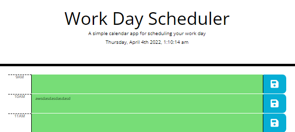

# Day-Planner

## A simple day planner
*created by John Hysong*

A day planner made using jquery, bootstrap and moment js.

- used local storage to save entries so they remain when the page is refreshed or opened again in the future
- uses moment js to place current time
- jquery and moment js used to determine the color coding of the planner based on the time of day.

[Repo](https://github.com/johnatticus/Day-Planner)

[Live Link](https://johnatticus.github.io/Day-Planner/)